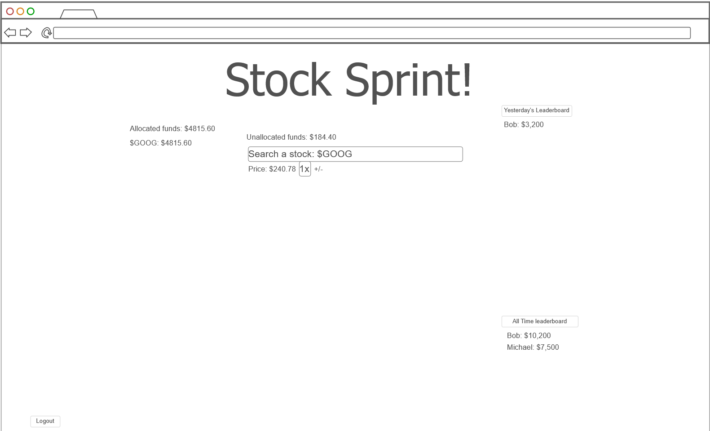

# Stock Sprint

[My Notes](notes.md)

Stock Sprint is an app where each day users get fake currency and compete to see who can make the most money off of the stock market in a day.

> [!NOTE]
>  This is a template for your startup application. You must modify this `README.md` file for each phase of your development. You only need to fill in the section for each deliverable when that deliverable is submitted in Canvas. Without completing the section for a deliverable, the TA will not know what to look for when grading your submission. Feel free to add additional information to each deliverable description, but make sure you at least have the list of rubric items and a description of what you did for each item.

> [!NOTE]
>  If you are not familiar with Markdown then you should review the [documentation](https://docs.github.com/en/get-started/writing-on-github/getting-started-with-writing-and-formatting-on-github/basic-writing-and-formatting-syntax) before continuing.

## 🚀 Specification Deliverable

> [!NOTE]
>  Fill in this sections as the submission artifact for this deliverable. You can refer to this [example](https://github.com/webprogramming260/startup-example/blob/main/README.md) for inspiration.

For this deliverable I did the following. I checked the box `[x]` and added a description for things I completed.

- [x] Proper use of Markdown
- [x] A concise and compelling elevator pitch
- [x] Description of key features
- [x] Description of how you will use each technology
- [x] One or more rough sketches of your application. Images must be embedded in this file using Markdown image references.

### Elevator pitch

Have you ever wanted to test your stock market intuition? At Stock Sprint, every day users receive fake currency to invest in stocks at the market’s opening price and automatically sell at the end of the day. Compete with other participants and climb the leaderboard to see who has the best market instincts.

### Design

### Key features

- Secure login over HTTPS
- Look up opening market stock prices
- Daily leaderboard and all time leaderboard

### Technologies

I am going to use the required technologies in the following ways.

- **HTML** - Uses correct HTML structure with two pages: one for login, and one for the overview.
- **CSS** - Responsive application styling that looks good on different screen sizes. Uses good whitespace, color choice, and contrast.
- **React** - Single-page application with components for login, buying stocks, leaderboard display, and backend calls. Reacts dynamically to user actions.
- **Service** - Backend service with endpoints for:
                - Login
                - Buying stocks
                - Updating leaderboard
- **DB/Login** - Stores users, stock purchases, and leaderboard data.
- **WebSocket** - Sends real-time notifications to connected clients when the daily leaderboard updates.

## 🚀 AWS deliverable

For this deliverable I did the following. I checked the box `[x]` and added a description for things I completed.

- [x] **Server deployed and accessible with custom domain name** - [My server link](https://stocksprint.click).

## 🚀 HTML deliverable

For this deliverable I did the following. I checked the box `[x]` and added a description for things I completed.

- [X] **HTML pages** - I did not complete this part of the deliverable.
- [X] **Proper HTML element usage** - I did not complete this part of the deliverable.
- [X] **Links** - I did not complete this part of the deliverable.
- [X] **Text** - I did not complete this part of the deliverable.
- [X] **3rd party API placeholder** - I did not complete this part of the deliverable.
- [X] **Images** - I did not complete this part of the deliverable.
- [X] **Login placeholder** - I did not complete this part of the deliverable.
- [X] **DB data placeholder** - I did not complete this part of the deliverable.
- [X] **WebSocket placeholder** - I did not complete this part of the deliverable.

## 🚀 CSS deliverable

For this deliverable I did the following. I checked the box `[x]` and added a description for things I completed.

- [X] **Header, footer, and main content body** - Stylized header with background color, fixed positioning, and internal layout using flexbox. Footer includes spacing, colors, and github link. Main content structured using flexbox.
- [X] **Navigation elements** - Consistent navigation bar with stylized links, active state, horizontal scroll support for smaller screens, and responsive font sizing using clamp().
- [X] **Responsive to window resizing** - Implemented responsive design using flexbox and relative units like % and clamp(). Included a viewport meta tag for mobile support. Used media queries to adjust layout for smaller viewports.
- [X] **Application elements** - Styled login form, buy form, leaderboard table, and profit banner using CSS with clean alignment, inline-block banners, shadows, and border accents.
- [X] **Application text content** - Styled text elements like the app description, "Welcome" header, and profit summary using typography, color, padding, and layout. Emphasis on clean, readable presentation.
- [X] **Application images** - Applied responsive styles to floating images, including max-width: 100%, float, and media queries for layout adjustments on smaller screens.

## 🚀 React part 1: Routing deliverable

For this deliverable I did the following. I checked the box `[x]` and added a description for things I completed.

- [ ] **Bundled using Vite** - I did not complete this part of the deliverable.
- [ ] **Components** - I did not complete this part of the deliverable.
- [ ] **Router** - I did not complete this part of the deliverable.

## 🚀 React part 2: Reactivity deliverable

For this deliverable I did the following. I checked the box `[x]` and added a description for things I completed.

- [ ] **All functionality implemented or mocked out** - I did not complete this part of the deliverable.
- [ ] **Hooks** - I did not complete this part of the deliverable.

## 🚀 Service deliverable

For this deliverable I did the following. I checked the box `[x]` and added a description for things I completed.

- [ ] **Node.js/Express HTTP service** - I did not complete this part of the deliverable.
- [ ] **Static middleware for frontend** - I did not complete this part of the deliverable.
- [ ] **Calls to third party endpoints** - I did not complete this part of the deliverable.
- [ ] **Backend service endpoints** - I did not complete this part of the deliverable.
- [ ] **Frontend calls service endpoints** - I did not complete this part of the deliverable.
- [ ] **Supports registration, login, logout, and restricted endpoint** - I did not complete this part of the deliverable.

## 🚀 DB deliverable

For this deliverable I did the following. I checked the box `[x]` and added a description for things I completed.

- [ ] **Stores data in MongoDB** - I did not complete this part of the deliverable.
- [ ] **Stores credentials in MongoDB** - I did not complete this part of the deliverable.

## 🚀 WebSocket deliverable

For this deliverable I did the following. I checked the box `[x]` and added a description for things I completed.

- [ ] **Backend listens for WebSocket connection** - I did not complete this part of the deliverable.
- [ ] **Frontend makes WebSocket connection** - I did not complete this part of the deliverable.
- [ ] **Data sent over WebSocket connection** - I did not complete this part of the deliverable.
- [ ] **WebSocket data displayed** - I did not complete this part of the deliverable.
- [ ] **Application is fully functional** - I did not complete this part of the deliverable.
